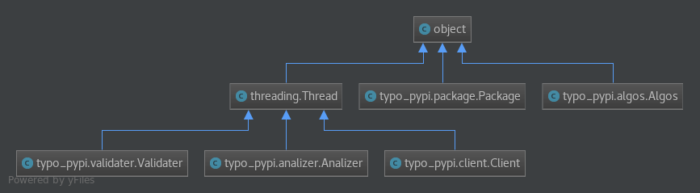

### typo_pypi, experimental methods 
  

analizer: distributes a typolist for package managers, as of yet: only pypi  
validater: checks each squatted package for malicious code  
client: uses the typolist and scrapes a package index, handles http stuff and misc. operations  
algos: uses various strategies for typo creation, within levenshtein <= 1

* should back theoretical claims in thesis work 
* creates a json with all typo packages found in pypi
* can be used as a blacklist for a standalone prevention software or to be intigrated in pypi's warehouse
* scraping takes a long time, either use results.json or run main.py

---
## Usage
* python 3.6
* pip install -r req.txt (venv recommended)
* switch to typo_pypi dir
* python main.py 1-3999